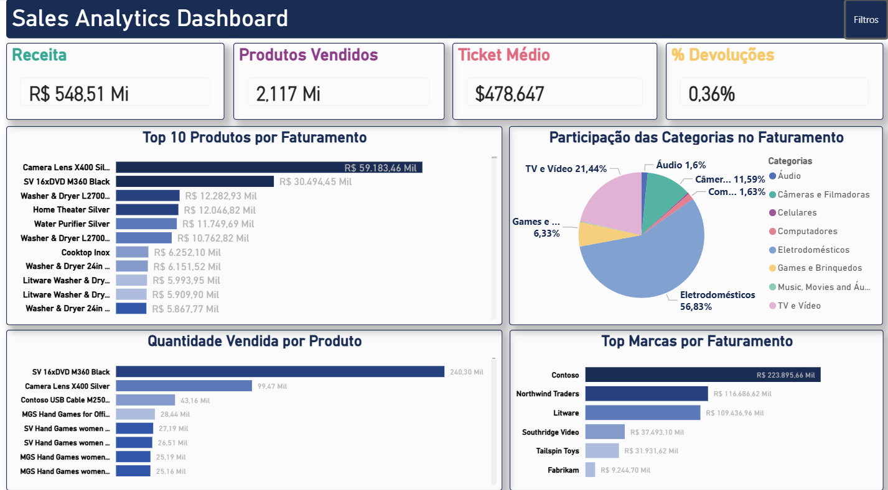
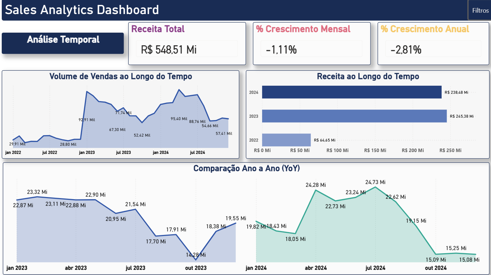
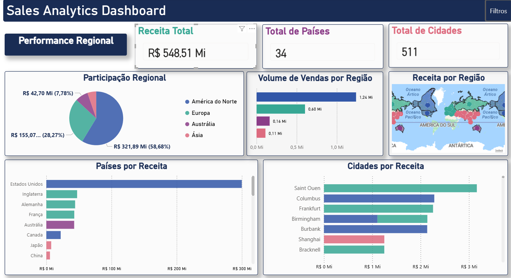

# Sales Analytics Dashboard

Projeto desenvolvido para a disciplina **Software Product: Analysis, Specification, Project & Implementation**.

Este projeto apresenta um dashboard analítico desenvolvido em **Power BI**, com foco em análise comercial, temporal e regional de dados de vendas.

---

## Objetivo

Desenvolver um dashboard interativo capaz de:

- Identificar padrões de vendas  
- Analisar desempenho comercial  
- Avaliar crescimento ao longo do tempo  
- Analisar distribuição regional das vendas  
- Apoiar a tomada de decisão baseada em dados  

---

## Tecnologias Utilizadas

- Power BI  
- Power Query  
- DAX  
- Modelagem de Dados (Modelo Estrela)  
- Time Intelligence  
- Tabela Calendário  

---

# 📊 Dashboards

## 🔹 Página 1 – Visão Geral (AC1)



Permite uma análise geral do desempenho comercial.

### Funcionalidades:
- Receita Total
- Produtos Vendidos
- Ticket Médio
- Percentual de Devoluções
- Top Produtos
- Ranking de Marcas
- Participação das Categorias

---

## 🔹 Página 2 – Análise Temporal (AC2)



Página desenvolvida para análise da evolução temporal das vendas.

### Funcionalidades:
- Receita ao longo do tempo
- Volume de vendas
- Crescimento Mensal (%)
- Crescimento Anual (%)
- Comparação Ano a Ano (YoY)

---

## 🔹 Página 3 – Performance Regional (AC3)



Página desenvolvida para análise geográfica e regional das vendas.

### Funcionalidades:
- Participação regional no faturamento
- Volume de vendas por região
- Receita por região no mapa
- Ranking de países
- Ranking de cidades
- Navegação interativa entre páginas

---

# 📈 Principais Métricas

- Receita Total  
- Produtos Vendidos  
- Ticket Médio  
- Percentual de Devoluções  
- Crescimento Mensal (%)  
- Crescimento Anual (%)  
- Total de Países  
- Total de Cidades  

---

# 📊 Análises Desenvolvidas

## 📌 AC1 – Análise Exploratória

- Top 10 produtos por faturamento  
- Participação das categorias  
- Quantidade vendida por produto  
- Ranking de marcas  
- Filtros interativos  

---

## 📈 AC2 – Análise Temporal

- Receita ao longo do tempo  
- Volume de vendas ao longo do tempo  
- Comparação Ano a Ano (YoY)  
- Crescimento mensal (%)  
- Crescimento anual (%)  
- Navegação entre páginas  

---

## 🌎 AC3 – Performance Regional

- Participação regional no faturamento
- Volume de vendas por região
- Receita por região no mapa
- Ranking de países
- Ranking de cidades
- Padronização visual por continente
- Navegação integrada entre páginas

---

# ⚙️ Navegação e Interatividade

O dashboard possui recursos de navegação interativa entre páginas, permitindo uma experiência mais dinâmica e intuitiva.

### Funcionalidades implementadas:
- Menu lateral interativo
- Botões de navegação
- Filtros persistentes
- Interação automática entre gráficos
- Navegação integrada entre análises
- Foco automático no mapa regional
- Padronização visual entre páginas

---

# 🗂️ Modelagem de Dados

O projeto utiliza modelo estrela (Star Schema), permitindo maior organização e performance analítica.

### Estrutura:
- Base de Vendas
- Cadastro de Produtos
- Cadastro de Clientes
- Cadastro de Lojas
- Tabela Calendário

### Recursos utilizados:
- Relacionamentos 1:N
- Time Intelligence
- Medidas DAX
- Padronização de datas
- Modelagem dimensional

### Principais funções DAX:
- CALCULATE
- DATEADD
- SAMEPERIODLASTYEAR

---

# 📁 Estrutura do Projeto

```bash
Sales-Analytics-Dashboard
│
├── dashboard
│   └── Sales_Analytics_Dashboard.pbix
│
├── dataset
│   ├── Base Vendas - 2022.xlsx
│   ├── Base Vendas - 2023.xlsx
│   ├── Base Vendas - 2024.xlsx
│   ├── Cadastro Clientes.xlsx
│   ├── Cadastro Lojas.xlsx
│   └── Cadastro Produto.xlsx
│
└── docs
    ├── dashboard.png
    ├── dashboard_temporal.png
    ├── dashboard_regional.png
    ├── AC1_Relatorio.pdf
    ├── AC2_Relatorio.pdf
    └── AC3_Relatorio.pdf
