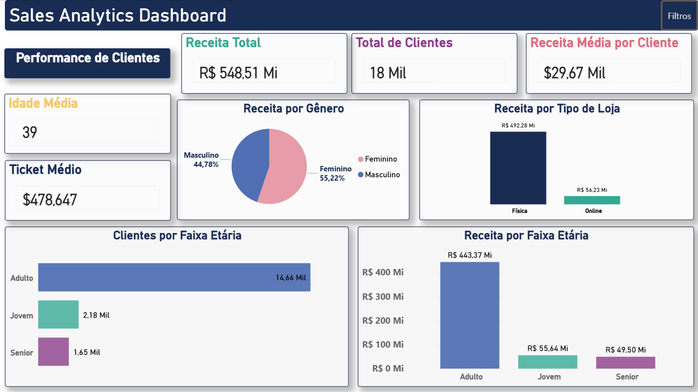

# Sales Analytics Dashboard

Projeto desenvolvido para a disciplina **Software Product: Analysis, Specification, Project & Implementation**.

O projeto consiste no desenvolvimento de um dashboard analítico em **Power BI**, utilizando técnicas de **Modelagem Dimensional**, **Power Query**, **DAX** e **Business Intelligence**, com foco na análise comercial, temporal, regional e comportamental dos clientes.

---

# 🎯 Objetivo

Desenvolver um dashboard interativo capaz de:

* Identificar padrões de vendas;
* Analisar desempenho comercial;
* Avaliar crescimento ao longo do tempo;
* Analisar distribuição regional das vendas;
* Compreender o perfil dos clientes;
* Avaliar comportamento de compra por faixa etária e gênero;
* Apoiar a tomada de decisão baseada em dados.

---

# 🛠️ Tecnologias Utilizadas

* Power BI
* Power Query
* DAX
* Modelagem Dimensional (Star Schema)
* Time Intelligence
* Tabela Calendário
* Bookmarks
* Navegação entre páginas
* Filtros sincronizados
* GitHub Projects

---

# 📊 Dashboards

## 🔹 Página 1 – Visão Geral (AC1)


Permite uma análise geral do desempenho comercial.

### Funcionalidades

* Receita Total
* Produtos Vendidos
* Ticket Médio
* Percentual de Devoluções
* Top 10 Produtos por Faturamento
* Quantidade Vendida por Produto
* Participação das Categorias
* Ranking de Marcas
* Filtros Interativos

---

## 🔹 Página 2 – Análise Temporal (AC2)


Página desenvolvida para análise da evolução temporal das vendas.

### Funcionalidades

* Receita ao longo do tempo
* Volume de vendas ao longo do tempo
* Crescimento Mensal (%)
* Crescimento Anual (%)
* Comparação Ano a Ano (YoY)
* Filtros temporais
* Navegação integrada

---

## 🔹 Página 3 – Performance Regional (AC3)


Página desenvolvida para análise geográfica e regional das vendas.

### Funcionalidades

* Participação regional no faturamento
* Volume de vendas por continente
* Receita por região no mapa
* Ranking de países
* Ranking de cidades
* Padronização visual por continente
* Navegação integrada

---

## 🔹 Página 4 – Performance de Clientes (Prova)



Página desenvolvida para análise do perfil dos clientes e comportamento de compra.

### Funcionalidades

* Receita por Gênero
* Receita por Tipo de Loja
* Clientes por Faixa Etária
* Receita por Faixa Etária
* Total de Clientes
* Receita Média por Cliente
* Ticket Médio
* Idade Média
* Navegação integrada
* Filtros globais sincronizados

---

# 📈 Principais Métricas

* Receita Total
* Produtos Vendidos
* Ticket Médio
* Percentual de Devoluções
* Crescimento Mensal (%)
* Crescimento Anual (%)
* Comparação YoY
* Total de Países
* Total de Cidades
* Total de Clientes
* Receita Média por Cliente
* Idade Média

---

# 📊 Análises Desenvolvidas

## 📌 AC1 – Análise Exploratória

* Top 10 Produtos por Faturamento
* Quantidade Vendida por Produto
* Participação das Categorias
* Ranking de Marcas
* Indicadores Comerciais
* Filtros Interativos

---

## 📈 AC2 – Análise Temporal

* Receita ao longo do tempo
* Volume de vendas ao longo do tempo
* Crescimento Mensal (%)
* Crescimento Anual (%)
* Comparação Ano a Ano (YoY)
* Navegação integrada

---

## 🌎 AC3 – Performance Regional

* Participação regional no faturamento
* Volume de vendas por continente
* Receita por região
* Ranking de países
* Ranking de cidades
* Padronização visual regional
* Navegação integrada

---

## 👥 Prova – Performance de Clientes

* Receita por Gênero
* Receita por Tipo de Loja
* Clientes por Faixa Etária
* Receita por Faixa Etária
* Total de Clientes
* Receita Média por Cliente
* Ticket Médio
* Idade Média
* Navegação integrada
* Filtros globais sincronizados

---

# ⚙️ Navegação e Interatividade

O dashboard possui recursos de navegação interativa entre páginas, proporcionando uma experiência dinâmica e intuitiva para o usuário.

### Funcionalidades implementadas

* Menu lateral interativo
* Botões de navegação
* Bookmarks
* Navegação entre páginas
* Filtros persistentes
* Filtros sincronizados
* Interação automática entre gráficos
* Navegação integrada entre análises
* Padronização visual do projeto

---

# 🗂️ Modelagem de Dados

O projeto utiliza um modelo dimensional do tipo **Star Schema**, composto por uma tabela fato e quatro tabelas dimensão.


### Tabela Fato

**Base de Vendas**

### Tabelas Dimensão

* Calendário
* Cadastro de Clientes
* Cadastro de Produtos
* Cadastro de Lojas

### Recursos utilizados

* Relacionamentos 1:N
* Chaves Primárias (PK)
* Chaves Estrangeiras (FK)
* Time Intelligence
* Medidas DAX
* Modelagem Dimensional
* Padronização de Datas

---

# 📐 Principais Funções DAX

Durante o desenvolvimento foram utilizadas diversas medidas para análise e cálculo de indicadores.

### Funções utilizadas

* CALCULATE
* SUM
* AVERAGE
* DISTINCTCOUNT
* DIVIDE
* DATEADD
* SAMEPERIODLASTYEAR
* TOTALYTD

### Indicadores desenvolvidos

* Receita Total
* Ticket Médio
* Receita Média por Cliente
* Crescimento Mensal (%)
* Crescimento Anual (%)
* Comparação YoY
* Participação no Faturamento
* Percentual de Devoluções

---

# 🚀 Evolução do Projeto

| Etapa | Objetivo                |
| ----- | ----------------------- |
| AC1   | Dashboard Comercial     |
| AC2   | Análise Temporal        |
| AC3   | Performance Regional    |
| Prova | Performance de Clientes |

---

# 📁 Estrutura do Projeto

```bash
Sales-Analytics-Dashboard
│
├── dashboard
│   └── Sales_Analytics_Dashboard.pbix
│
├── dataset
│   ├── Base Vendas - 2022.xlsx
│   ├── Base Vendas - 2023.xlsx
│   ├── Base Vendas - 2024.xlsx
│   ├── Cadastro Clientes.xlsx
│   ├── Cadastro Lojas.xlsx
│   └── Cadastro Produto.xlsx
│
├── docs
│   ├── dashboard.png
│   ├── dashboard_temporal.png
│   ├── dashboard_regional.png
│   ├── dashboard_clientes.png
│   ├── modelo_dimensional.png
│   ├── AC1_Relatorio.pdf
│   ├── AC2_Relatorio.pdf
│   ├── AC3_Relatorio.pdf
│   └── Prova_Relatorio.pdf
│
└── README.md

